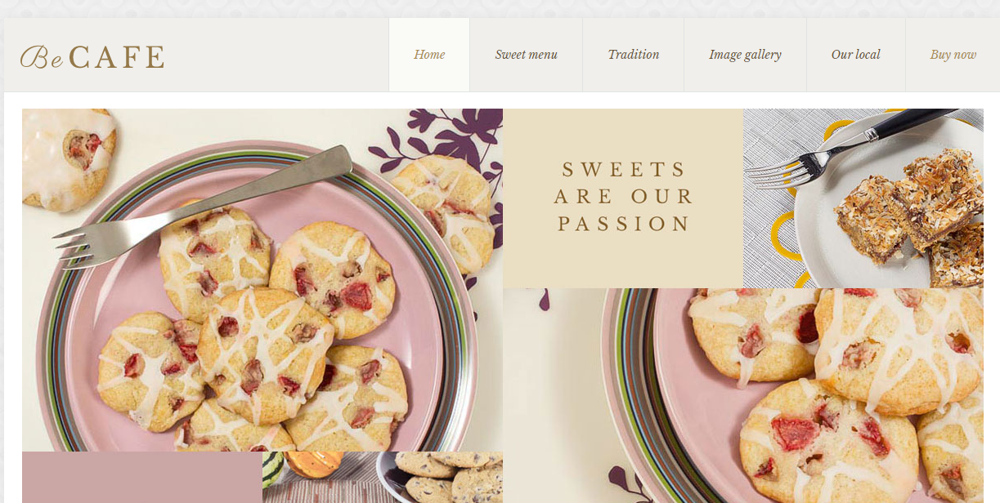
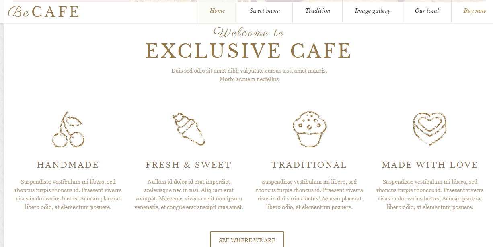
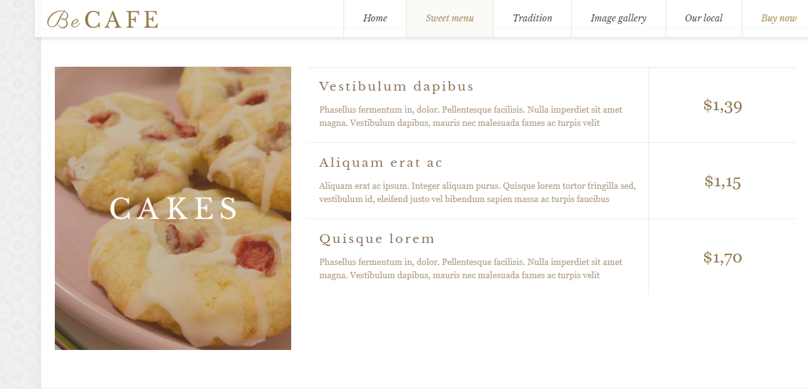
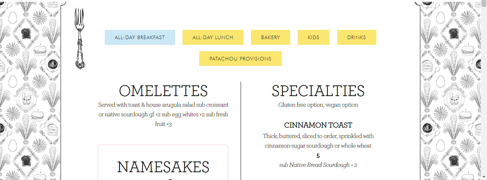
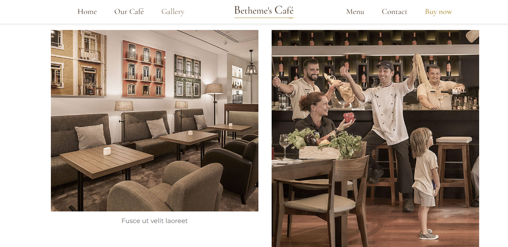

## مقدمه

در این تمرین میخواهیم ظاهر سایت یک کافی شاپ را طراحی کنیم. برای پیاده سازی از HTML و CSS استفاده خواهیم کرد. طراحی شما لزوما مانند نمونه های ارائه شده نباید باشد.

## صفحه اصلی وبسایت

این وبسایت شامل یک صفحه است که اطلاعات مختلف کافی شاپ در آن آورده شده است، در ادامه به توضیح بخش های مختلف آن میپردازیم.

## نوار منو

در بالای وبسایت یک نوار منو خواهیم داشت. این نوار دارای گزینه هایی است که به بخش های مهم این وبسایت متصل ارجاع خواهد داد، نمونه ای از نوار منو را میتوانید در عکس زیر مشاهده نمایید

می توانید از gradient نیز برای رنگ آمیزی جذاب تر منوی خود استفاده نمایید.

## توضیحات کافی شاپ

در ابتدای وبسایت خود، توضیحی درباره کافی شاپ، مکان آن، زمانبندی بنویسید و همچنین عکس هایی از محیط آن قرار دهید.
به عنوان مثال، می توانید توضیحات را اینگونه پیاده سازی نمایید

## منوی کافی شاپ

در این وبسایت، باید به طور دسته بندی شده، منوی خود را قرار دهید به طوری که نوشیدنی ها و کیک و ... در دسته های متفاوت نمایش داده شوند.
به طور مثال طراحی منوی وب سایت زیر قابل توجه است.

در منو، باید دسته بندی ها قابل انتخاب باشد به طوری که کاربر بتواند از لیستی از دسته بندی ها، دسته مورد نظر خود را انتخاب کند (نیازمند javascript)
به طور مثال عکس زیر قابلیت زیر را نشان می دهد

همچنین قیمت و توضیحات مختصری از هر مورد در منو ارائه دهید.
قرار دادن عکس آیتم های منو در کنار آنها امتیاز محسوب می شود.

## گالری

قسمتی را هم برای قرار دادن تعدادی عکس جذاب از کافی شاپ خود در نظر بگیرید تا مشتریان بتوانند با شناخت بهتری از محیط کافه شما تصمیم بگیرند.
عکس زیر نمایانگر این مورد است.

## رزرو

در نهایت، وب سایت شما باید به کاربران امکان رزرو آنلاین را هم بدهد. فیلد های مورد نیاز رزرو به صورت زیر است:
* مشخصات مشتری
* تعداد نفرات
* زمان رزرو
* سفارش انتخاب شده

به طور مثال با کلیک بر ورودی سفارش، می توان لیستی از آیتم ها را نشان داد و کاربر با کلیک بر هر یک، آن را به سبد خرید خود اضافه خواهد کرد.
### مراجع
می توانید از وبسایت های زیر برای طراحی خود کمک بگیرید
https://themes.muffingroup.com/be/cafe/ \
https://themes.muffingroup.com/be/cafe2/ \
https://www.cafepatachou.com/cafe-patachou-menu/